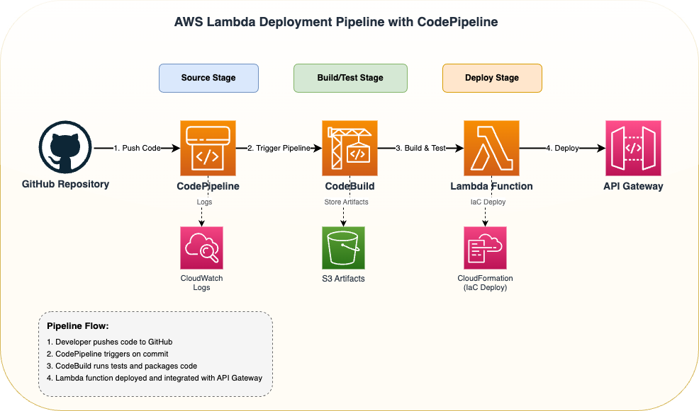

# aws-app-template
Template repo to spin off application on AWS

## Architecture



## Repository Rules

This repository enforces strict rules for branch naming, commit messages, and protected branches.

### Branch Naming Convention
- **Pattern:** `type/jira-123` (lowercase, kebab-case)
- **Examples:** `feature/jira-123`, `bugfix/proj-456`, `hotfix/issue-789`

### Commit Message Convention
- **Pattern:** `jira-123: description` or `deps-auto: description` (lowercase)
- **Examples:** `jira-123: add user authentication`, `deps-auto: update terraform`

### Protected Branches
- **`main`** - Production branch (requires PR with 1 approval)
- **`dev`** - Development branch (requires PR with 1 approval)

No force pushes or deletions allowed on protected branches.

### Version Tags
- **Pattern:** `v*` (e.g., `v1.0.0`, `v2.1.3-alpha`)
- Protected from force updates and deletions

### Required Status Checks
Before merging to `main` or `dev`, the following checks must pass:
- `pr-checks` - PR validation and testing
- `static-code-scan` - Security and code quality scanning
- `terraform-plan` - Infrastructure validation

See [CONTRIBUTING.md](./CONTRIBUTING.md) for detailed guidelines.

## Repository Rulesets

All rules are defined in `/rulesets/` and automatically applied via GitHub Actions.

See [rulesets/README.md](./rulesets/README.md) for details.

### Fork Governance

When you fork this template, a workflow automatically:
- ✅ Validates repo name follows `aws-*` convention
- ✅ Applies all rulesets to your fork
- ✅ Creates `dev` branch and sets as default
- ✅ Creates environments: `dev`, `staging`, `prod`
- ✅ Enables Dependabot & vulnerability alerts
- ✅ Enables auto-delete branch after merge
- ✅ Checks required files are updated
- ✅ Creates setup issue with instructions

**Setup:** Template repo needs `GH_PAT` secret. See [.github/workflows/README.md](./.github/workflows/README.md).

## Pull Request Template

A PR template is included at `.github/pull_request_template.md` that automatically appears when creating PRs. It ensures:
- Description and JIRA ticket are provided
- Type of change is specified
- Testing checklist is completed
- Code review standards are followed

**Enforcement:** The template is enforced through code review - PRs without proper completion will not be approved.

## Getting Started

1. **Clone the repository**
   ```bash
   git clone <repository-url>
   cd aws-app-template
   ```

2. **Create a feature branch**
   ```bash
   git checkout -b feature/jira-123
   ```

3. **Make changes and commit**
   ```bash
   git add .
   git commit -m "jira-123: implement new feature"
   ```

4. **Push and create PR**
   ```bash
   git push origin feature/jira-123
   ```

## Contributing

Please read [CONTRIBUTING.md](./CONTRIBUTING.md) for details on our code of conduct and the process for submitting pull requests.
